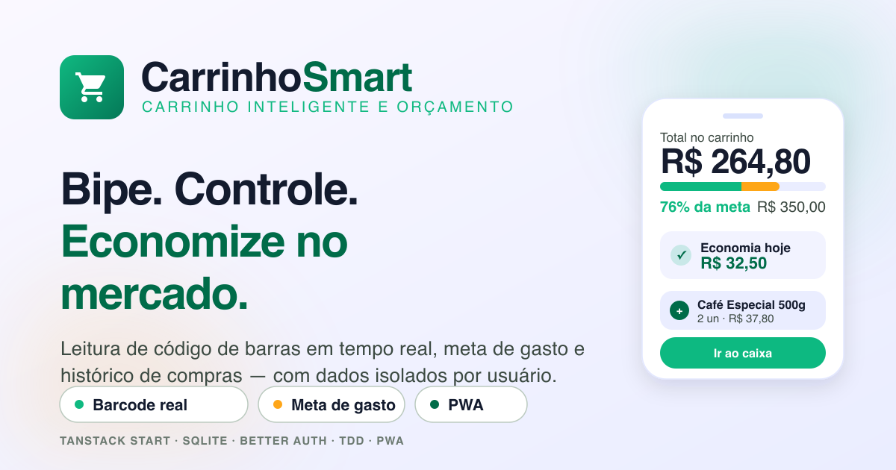

# CarrinhoSmart 🛒



Aplicativo mobile-first de **carrinho inteligente e controle de orçamento** para supermercado. Você bipa os produtos, acompanha o gasto em tempo real contra uma meta, gerencia a lista de compras e fecha a compra com um recibo e resumo por categoria.

Construído com **TanStack Start + SQLite**, **autenticação multitenant** (Better Auth, dados isolados por usuário), seguindo **TDD** (Vitest) e com dados de demonstração gerados por **faker**.

> Baseado nos mockups do projeto Stitch _Smart Cart Retail & Budgeting_ (`DESIGN.md`), com o design system traduzido para tokens do Tailwind v4.

---

## 📱 Telas

| Rota                  | Tela                     | Descrição                                                                                                                                                                               |
| --------------------- | ------------------------ | --------------------------------------------------------------------------------------------------------------------------------------------------------------------------------------- |
| `/login`              | **Entrar**               | Login com e-mail/senha (Better Auth) e atalho para criar conta.                                                                                                                         |
| `/signup`             | **Criar conta**          | Cadastro com e-mail/senha. A conta começa **vazia** — nenhum dado é criado automaticamente.                                                                                             |
| `/bem-vindo`          | **Onboarding**           | Primeira tela pós-cadastro: começar do zero ou explorar com dados de exemplo (ação explícita).                                                                                          |
| `/`                   | **Carrinho + Orçamento** | Monitor de gasto em tempo real, meta ajustável, gauge, busca, filtros por categoria, stepper de quantidade, economia e dock "Ir ao caixa".                                              |
| `/scanner`            | **Scanner de produtos**  | Leitura real de código de barras pela câmera (`getUserMedia` + `BarcodeDetector`), com lanterna, entrada manual de EAN, preço na etiqueta, quantidade, promoção e impacto no orçamento. |
| `/lista`              | **Lista de compras**     | Progresso (anel + barra), itens pendentes vs. já no carrinho, adição rápida e "bipar" item da lista direto para o carrinho.                                                             |
| `/historico`          | **Histórico**            | Visão mensal (gasto, meta, economia, frequência), navegação por mês, busca e filtros por mercado.                                                                                       |
| `/resumo`             | **Resumo do mês**        | Totais do mês, performance vs. meta, distribuição de gastos por categoria e compras do período.                                                                                         |
| `/compra/$purchaseId` | **Recibo**               | Resumo da compra finalizada: total pago, economia, distribuição por categoria e recibo item a item.                                                                                     |

---

## 🧱 Stack

- **[TanStack Start](https://tanstack.com/start)** (React 19, roteamento por arquivos, **server functions**)
- **SQLite** via [`better-sqlite3`](https://github.com/WiseLibs/better-sqlite3) (sem ORM)
- **[Better Auth](https://www.better-auth.com/)** (e-mail/senha, sessões por cookie, isolamento por usuário)
- **Tailwind CSS v4** (tokens do design system em `@theme`)
- **Vitest** para testes
- **[faker](https://fakerjs.dev/)** para seed determinístico
- **PWA** (Web App Manifest + service worker) com ícones gerados a partir do logo
- **Nitro** como servidor de produção

---

## 🚀 Começando

Requisitos: **Node.js >= 22** e npm.

```bash
cp .env.example .env   # ajuste BETTER_AUTH_SECRET (mín. 32 caracteres)
npm install
npm run seed           # cria o catálogo, a conta demo e dados de demonstração
npm run dev            # http://localhost:3000
```

O banco é criado automaticamente em `data/carrinhosmart.db` e as tabelas do Better Auth são migradas no start. O catálogo (categorias, lojas e produtos) é populado sozinho na primeira requisição, se estiver vazio.

**Conta de demonstração** (após `npm run seed`): `demo@carrinhosmart.dev` / `demo12345`.

Variáveis de ambiente (`.env`):

| Variável             | Descrição                                        |
| -------------------- | ------------------------------------------------ |
| `BETTER_AUTH_SECRET` | Segredo das sessões (mín. 32 caracteres).        |
| `BETTER_AUTH_URL`    | URL base da aplicação (`http://localhost:3000`). |
| `DATABASE_URL`       | Arquivo SQLite (`data/carrinhosmart.db`).        |
| `SEED`               | Semente determinística do faker (padrão `42`).   |

### Scripts

| Script                    | Descrição                                                            |
| ------------------------- | -------------------------------------------------------------------- |
| `npm run dev`             | Servidor de desenvolvimento (Vite, porta 3000).                      |
| `npm run build`           | Build de produção (Nitro, saída em `.output`).                       |
| `npm run preview`         | Pré-visualiza o build de produção.                                   |
| `npm test`                | Roda toda a suíte de testes (Vitest).                                |
| `npm run test:watch`      | Testes em modo watch.                                                |
| `npm run typecheck`       | Checagem de tipos (`tsc --noEmit`).                                  |
| `npm run lint`            | ESLint (flat config) com zero warnings permitidos.                   |
| `npm run lint:fix`        | ESLint aplicando correções automáticas.                              |
| `npm run format`          | Formata o projeto com Prettier.                                      |
| `npm run format:check`    | Verifica a formatação sem alterar arquivos.                          |
| `npm run seed`            | (Re)popula o banco com faker.                                        |
| `npm run db:reset`        | Apaga o banco e roda o seed novamente.                               |
| `npm run generate-routes` | Regenera o `routeTree.gen.ts`.                                       |
| `npm run icons`           | Regenera favicon e ícones do PWA (requer `rsvg-convert` + `magick`). |

---

## 🏗️ Arquitetura

O código é organizado em camadas, cada uma com sua própria suíte de testes:

```
src/
├── domain/                 # Regras de negócio puras (sem I/O, sem React, sem SQL)
│   ├── money.ts            # Formatação/parsing BRL, quantidades (un/kg/L)
│   ├── budget.ts           # Status da meta, níveis (safe/warning/over), gauge segmentado
│   ├── cart.ts             # Totais, subtotais, economia, quantidade, itens extras
│   ├── shopping-list.ts    # Progresso da lista, agrupamento, quick add
│   ├── analytics.ts        # Distribuição por categoria, visão mensal, tendência de preço
│   └── types.ts            # Tipos compartilhados
│
├── server/
│   ├── auth/
│   │   ├── auth.ts         # createAuth (Better Auth), migrateAuth, resolveUser
│   │   └── session.ts      # requireSession() a partir dos headers da requisição
│   ├── db/
│   │   ├── schema.ts       # DDL + migrate() (inclui user_id e migração incremental)
│   │   ├── client.ts       # Conexão (factory + singleton)
│   │   ├── repositories.ts # Acesso a dados (products, carts, lists, purchases, price_history)
│   │   ├── seed.ts         # Catálogo global + dados por usuário (faker, determinístico)
│   │   └── runtime.ts      # Runtime singleton (db + repo + auth) + auto-seed do catálogo
│   ├── services/           # Orquestração testável sobre os repositórios
│   │   ├── cart-service.ts
│   │   ├── scanner-service.ts
│   │   ├── list-service.ts
│   │   └── history-service.ts
│   └── functions/          # Server functions consumidas pelas rotas
│
├── auth/                   # Contexto de sessão no cliente (React)
├── lib/auth-client.ts      # Cliente Better Auth (signIn/signUp/signOut)
├── components/             # UI reutilizável (nav, gauge, anel de progresso, sheet...)
└── routes/                 # Telas (file-based routing) + /api/auth/$ (handler Better Auth)
```

**Fluxo de dados:** `route loader → server function → requireSession() → service → repository → SQLite`. Mutações chamam a server function e depois `router.invalidate()` para recarregar o loader.

---

## ✅ TDD

O desenvolvimento seguiu o ciclo **red → green → refactor**, escrevendo os testes antes da implementação em cada camada.

- **115 testes** em **11 arquivos**, rodando com `npm test`.
- Domínio: funções puras cobrindo dinheiro, orçamento, carrinho, lista, analytics e **código de barras (EAN-13, dígito verificador e classificação de formatos)**.
- Persistência: repositórios testados com **SQLite em memória** (`:memory:`), incluindo checkout transacional, histórico de preços e **isolamento por usuário**.
- Seed: garante determinismo por seed, idempotência, reset limpo e separação de dados entre usuários.
- Serviços: fluxos completos (overview do carrinho, leitura por código de barras, bipar item da lista, agregações mensais e recibo).
- Auth: signup, signin, rejeição de duplicado/senha errada, resolução de sessão por cookie e hook de criação de usuário.

```bash
npm test        # 115 passing
npm run typecheck
npm run build
```

---

## 🔐 Autenticação e isolamento (multitenant)

O modelo de tenant é **usuário individual**: cada conta enxerga apenas os próprios dados.

- **Better Auth** com e-mail/senha, sessão em cookie `httpOnly` e tabelas `user`, `session`, `account` e `verification` criadas via migração programática (`getMigrations(...).runMigrations()`), mantendo o schema em sincronia com a versão da lib.
- O handler fica em `/api/auth/$` e o cliente (`better-auth/react`) cuida de signup, signin e signout.
- O `beforeLoad` da raiz chama `fetchSession`; rotas privadas redirecionam para `/login` e o usuário logado é redirecionado para fora de `/login`/`/signup`.
- Toda server function passa por `requireSession()`, que resolve o usuário a partir dos headers (`getRequestHeaders`) e injeta o `userId` nos serviços. Sem sessão, a operação é rejeitada.
- **Isolamento no SQL:** `carts`, `shopping_lists`, `purchases` e `price_history` têm `user_id` e todas as consultas filtram por ele. O catálogo (`categories`, `stores`, `products`) é referência compartilhada.
- Ao criar a conta, **nada é gerado automaticamente**. O usuário cai em `/bem-vindo` e escolhe entre começar com o carrinho/lista vazios ou **popular dados de exemplo** (ação explícita, isolada por conta, registrada em `user_preferences`).

> Os testes cobrem o isolamento: um segundo usuário não vê carrinho, lista, compras, histórico de preços nem consegue operar sobre recursos de outro.

---

## 📲 PWA, favicon e ícones

O app é instalável: **Web App Manifest** + **service worker** registrados na raiz.

- **Manifest** em `public/manifest.json` (`display: standalone`, `theme_color`, ícones `any` e `maskable`).
- **Service worker** (`public/sw.js`) com estratégia **cache-first para assets estáticos** (`/assets/`, `/icons/`, manifest, favicon, apple-touch-icon). Navegações e `/api/*` **nunca** são cacheadas — evitando servir HTML autenticado para quem está deslogado.
- Registro em `src/routes/__root.tsx` (`navigator.serviceWorker.register('/sw.js')`).
- Metadados no `<head>`: `favicon.ico`, `icon.svg`, `apple-touch-icon`, `manifest`, `theme-color` e tags `apple-mobile-web-app-*`.

Os ícones vêm do **mesmo ícone exibido na tela de sign-in** (quadrado verde `#10b981 → #047857` com o carrinho branco), exportado dos SVGs `public/icon.svg` e `public/icon-maskable.svg`:

| Arquivo                       | Uso                                       |
| ----------------------------- | ----------------------------------------- |
| `public/favicon.ico`          | Favicon (16/32/48).                       |
| `public/icon.svg`             | Favicon vetorial / navegadores modernos.  |
| `public/icons/icon-192.png`   | Manifest `any`.                           |
| `public/icons/icon-512.png`   | Manifest `any` / splash.                  |
| `public/icons/maskable-*.png` | Manifest `maskable` (Android adaptativo). |
| `public/apple-touch-icon.png` | Ícone no iOS (180×180).                   |

Para regerar após editar os SVGs (requer `librsvg` e `imagemagick`):

```bash
npm run icons
```

> **Testar a instalação:** rode `npm run build && npm run preview` e abra em `http://localhost:3000` — o navegador oferece "Instalar app".

### Preview de link (Open Graph)

A imagem de compartilhamento fica em `public/og.png` (1200×630). As meta tags `og:*` e `twitter:*` são injetadas pelo `head` da rota raiz, com `og:image`, dimensões, `alt` e `summary_large_image`.

- Edite `public/og.svg` e regenere: `rsvg-convert -w 1200 -h 630 public/og.svg -o public/og.png`
- Defina `BETTER_AUTH_URL` com a URL pública (ex.: `https://meu-app.com`) para que as tags apontem para o domínio correto.

---

## 📷 Leitura de código de barras

O scanner usa a **câmera real do dispositivo**, sem bibliotecas externas:

- **`getUserMedia`** abre a câmera traseira (`facingMode: environment`), com **lanterna** quando o hardware expõe `torch`.
- **`BarcodeDetector`** (API nativa do Chromium) roda em um **loop de `requestAnimationFrame`**, com _cooldown_ para não repetir o mesmo código. Formatos preferidos: EAN-13, EAN-8, UPC-A/E, Code 128/39, ITF e QR.
- Se a API não existir, a UI informa e oferece a **digitação manual** do código — o mesmo caminho usado quando a etiqueta está danificada.
- O código lido (normalizado por `src/domain/barcode.ts`) é consultado no catálogo via server function e preenche preço, nome, marca e o histórico de preço do produto.
- Permissões são tratadas com mensagens acionáveis (negada / sem câmera / em uso), com botão para tentar novamente.

Validação de EAN-13 (dígito verificador) e a geração de códigos válidos para o seed ficam em `src/domain/barcode.ts`, cobertos por testes.

> A leitura automática exige **contexto seguro** (`localhost` ou HTTPS) e um navegador com `BarcodeDetector` (Chrome/Edge/Android). Em navegadores sem suporte, use a digitação manual.

---

## 🚀 Deploy (Cleat)

O projeto está publicado via **[Cleat](https://paas.gestaobem.com)** no servidor `gestaobem-cx33`:

- **URL:** https://carrinho.apps.gestaobem.com
- **App:** `carrinho-smart` · runtime **node** · porta `4001`
- **Build:** `npm run build` (Nitro) → start `node .output/server/index.mjs`
- **Config:** `.cleat_deploy/deploy.json` (`runtime: node`)

```bash
cleat deploy carrinho-smart --watch   # publica a branch main
cleat status carrinho-smart           # histórico de deploys
cleat logs <deployment_id> --follow   # logs de build
```

Variáveis de ambiente no painel (`cleat env set carrinho-smart K=V`): `BETTER_AUTH_SECRET`,
`BETTER_AUTH_URL`, `DATABASE_URL` e `SEED`.

> O SQLite persiste em `/opt/carrinho-smart/data` no servidor. Para reiniciar os dados de
> demonstração, rode `npm run db:reset` localmente antes de um deploy (ou ajuste o caminho via `DATABASE_URL`).

---

## 🔍 Qualidade, CI e pre-commit

- **ESLint** (flat config) com `typescript-eslint`, `react-hooks` e `react-refresh` — `npm run lint` roda com `--max-warnings 0`.
- **Prettier** como fonte de verdade da formatação — `npm run format:check` valida no CI.
- **Husky + lint-staged**: a cada commit o hook `.husky/pre-commit` roda:
  1. `lint-staged` → `eslint --fix` + `prettier --write` nos arquivos alterados;
  2. `npm test` → a suíte completa de testes.

Instale os hooks automaticamente com `npm install` (o script `prepare` executa `husky`).

- **GitHub Actions** (`.github/workflows/ci.yml`): em cada push/PR para `main` roda, no Node 22:
  `format:check` → `lint` → `typecheck` → `test` → `build`.

---

## 🗄️ Modelo de dados

| Tabela                          | Papel                                                                                          |
| ------------------------------- | ---------------------------------------------------------------------------------------------- |
| `user` / `session` / `account`  | Tabelas do Better Auth (contas, sessões e credenciais).                                        |
| `verification`                  | Tokens de verificação do Better Auth.                                                          |
| `user_preferences`              | Flags de onboarding por usuário (`demo_data_seeded`, `welcome_shown`).                         |
| `categories`                    | Categorias (mercearia, laticínios, hortifrúti, limpeza, higiene, padaria) — catálogo global.   |
| `stores`                        | Mercados disponíveis para troca de loja — catálogo global.                                     |
| `products`                      | Catálogo com `barcode` (EAN), unidade, preço de referência, corredor — catálogo global.        |
| `shopping_lists` / `list_items` | Lista ativa por usuário, itens pendentes e escaneados (preço esperado vs. bipado).             |
| `carts` / `cart_items`          | Carrinho ativo por usuário/loja, linhas com preço, quantidade, promoção e vínculo com a lista. |
| `purchases` / `purchase_items`  | Compras finalizadas por usuário (histórico, resumo e recibo).                                  |
| `price_history`                 | Preços registrados por usuário/produto/loja para sugerir preço e calcular tendência.           |

As tabelas pessoais possuem `user_id` e são sempre filtradas pelo usuário autenticado. Os valores monetários são armazenados **em centavos (inteiros)** para evitar erros de ponto flutuante.

---

## 🎨 Design system

Os tokens do `DESIGN.md` (cores, tipografia Plus Jakarta Sans, raios, elevação) foram portados para o `@theme` do Tailwind v4 em `src/styles.css`, reproduzindo a estética _Modern Tactile Minimalism_ dos mockups — gauge segmentado, chips, steppers táteis, bottom navigation com FAB central e safe areas.

---

## 🧪 Dados de demonstração

O seed (`src/server/db/seed.ts`) tem duas partes:

1. **Catálogo global** — 6 categorias, 4 mercados e ~29 produtos, populado automaticamente quando o banco está vazio.
2. **Dados por usuário** — lista ativa com itens pendentes/escaneados, carrinho em uso e histórico de compras em vários meses.

É **determinístico** (faker com semente fixa) e cria a conta de demonstração para você entrar:

```bash
npm run seed                 # demo@carrinhosmart.dev / demo12345
SEED=7 npm run seed          # outra variação de dados
```

Qualquer **novo cadastro** também recebe um conjunto de dados de demonstração próprio (via hook de criação de usuário), sempre isolado por conta.

---

## 📄 Licença

MIT.
